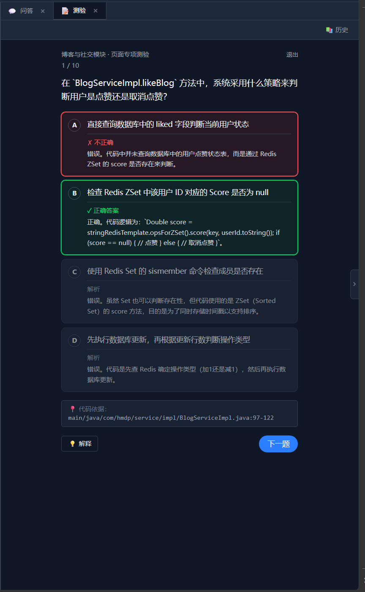

<div align="center">
  

  # 🤖 CoReader

  ### 读懂代码，不该只是一场对话。

  一个面向 AI Coding 时代的代码理解平台 —— 把项目转成可浏览的 Wiki、可追问的 Agent、可自测的 Quiz。

</div>


---

## 为什么有它

高强度使用 AI 写代码时，最稀缺的不是生成能力，而是**对项目本身的理解**：

- 整体架构长什么样？
- 这段代码的运行路径是什么？
- 这个模块到底负责啥？
- 这个奇怪的语法又是干嘛的？

用 Claude / ChatGPT 当然能问出来，但 chat 范式有几个绕不开的痛点：

- 🧩 **碎片化** —— 每次都从零开始喂上下文，问 10 次浪费 9 次
- 👀 **混乱的视觉** —— 代码、解释、追问、回答全混在一条时间线
- 📚 **难以沉淀** —— 关掉对话就什么都没了，下次还得再问一遍

**CoReader** 把"理解一个项目"这件事从对话流里解放出来：上传代码 → 自动生成结构化文档 + 智能问答 + 自测题，三种方式各取所需。

---

## 它能做什么

### 📖 Wiki —— 把项目自动写成一本书

上传项目后，后台会跑一条完整的分析管线：AST 拆解 → 模块识别 → 分层目录 → LLM 撰写。最终产出一套**层级化的 wiki 文档**：

```
项目概览
├─ 分类（Category）
│  └─ 章节（Chapter）
│     └─ 主题（Topic）
│        └─ 模块详情（Module Page）
```

每页都带可点击的源码引用（点击直接打开侧边代码窗口），不是空中楼阁式的解读。

### 💬 Q&A —— 两种问答模式

- **快速模式**：单次 LLM 调用 + 预先拼好的项目上下文，秒回。适合"这个变量啥意思"。
- **深度模式**：基于 Agent Loop，LLM 可以自主调用 7 个工具（查摘要、查符号、查调用关系、读文件、全文搜索…）在 SQLite 化的项目结构里"现场调研"，再综合回答。适合"这段流程是怎么走的"。

整个 Agent 思考过程在前端**实时流式可视化**：工具调用、参数、返回结果一一展开，不再是黑盒。多轮对话有完整记忆 + 自动压缩，长会话也不爆上下文。

### 📝 Quiz —— 给项目出题

基于已生成的 wiki 自动出选择题，校验你对项目的掌握度。给自己用、给团队新人用、给面试候选人用都行。每题都附带代码依据（`文件:行号`），可点击直接定位源码。

<p align="center">
  
</p>

---

## 技术亮点

| | |
|---|---|
| **AST 优先，不是 LLM 盲猜** | tree-sitter 多语言解析（Python / Rust / Java）→ 符号、调用边、入口点抽取 → SQLite 持久化 |
| **统一的 Agent Loop** | 一套循环驱动 Wiki / QA / Quiz 三个能力，工具系统可扩展，自动压缩长上下文 |
| **OpenAI 协议兼容** | 接 Qwen / Kimi / MiniMax / 任何 OpenAI 兼容网关，摘要类任务可走更便宜的 fast 模型 |
| **流式优先** | SSE 实时输出 token、工具调用、压缩事件，前端 Zustand 全程订阅 |

---

## 技术栈

**后端**：FastAPI · SQLite · tree-sitter · OpenAI 兼容 LLM（默认 Qwen / MiniMax）
**前端**：React 19 · TypeScript · Vite 8 · Tailwind CSS 4 · Zustand · react-markdown · highlight.js · Mermaid

---

## 快速开始

### 1. 准备 LLM 网关

复制环境变量模板：

```bash
cp .env.example .env
```

编辑 `.env`，至少填一个能用的 OpenAI 兼容网关：

```env
QWEN_API_KEY=sk-xxxxxxxx
QWEN_BASE_URL=https://dashscope.aliyuncs.com/compatible-mode/v1
QWEN_MODEL=qwen3.6-plus
```

> 变量名沿用 `QWEN_` 前缀只是历史原因 —— 实际走的是 OpenAI 协议，DashScope / sub2api / 自建 vLLM / 任何兼容端都行。`.env.example` 里有 MiniMax 的备选配置。

### 2. 启动后端

```bash
pip install -r backend/requirements.txt
PYTHONPATH=. uvicorn backend.main:app --reload --port 8000
```

> ⚠️ `PYTHONPATH=.` 是必须的，后端用绝对导入。

### 3. 启动前端

```bash
cd frontend
npm install
npm run dev
```

浏览器打开 Vite 输出的本地地址（默认 `http://localhost:5173`）即可。

---

## 项目结构

```
CoReader/
├─ backend/
│  ├─ controllers/         # FastAPI 路由（file / wiki / qa / quiz）
│  ├─ services/
│  │  ├─ agent/            # 核心 Agent Loop + 7 个工具 + Skill 系统
│  │  ├─ wiki/             # Wiki 生成管线
│  │  ├─ qa/               # 问答（fast / deep 双模式）
│  │  ├─ quiz/             # 题目生成
│  │  └─ llm/              # OpenAI 兼容客户端 + Prompt 模板
│  ├─ dao/                 # SQLite 持久化
│  ├─ models/              # Pydantic 数据模型
│  └─ utils/analysis/      # AST 分析管线（多语言）
└─ frontend/
   └─ src/
      ├─ components/       # Wiki / QA / Quiz / Upload / CodeDrawer
      ├─ store/            # Zustand stores
      ├─ services/         # 后端 API 封装（含 SSE 解析）
      ├─ contexts/         # 主题 + 国际化
      └─ i18n/             # 中英文文案
```

---

## 限制与已知问题

- 单个文件 ≤ 1MB，整个项目 ≤ 10MB / 200 个文件（防止 LLM 调用失控）
- AST 分析目前覆盖 Python / Rust / Java，其他语言上传后只做文本摘要
- 长任务（Wiki 全量生成）走后台异步 + 状态轮询，需要保持后端进程存活
- 目前未做用户隔离，仅适合本地或单租户场景使用

---

<div align="center">

Made with ☕ and 🤖 in 2026

</div>
