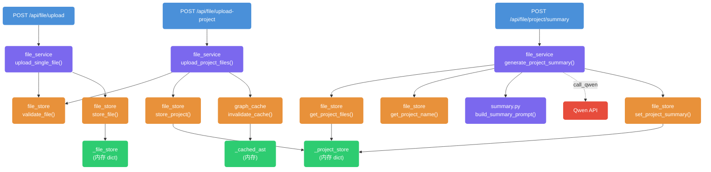

# file_controller 调用链

```mermaid
flowchart TB
    classDef ctrl fill:#4A90D9,color:#fff,stroke:none,rx:6
    classDef svc fill:#7B68EE,color:#fff,stroke:none,rx:6
    classDef dao fill:#E8913A,color:#fff,stroke:none,rx:6
    classDef data fill:#2ECC71,color:#fff,stroke:none,rx:6
    classDef ext fill:#E74C3C,color:#fff,stroke:none,rx:6

    %% Controller
    C1["POST /api/file/upload"]:::ctrl
    C2["POST /api/file/upload-project"]:::ctrl
    C3["POST /api/file/project/summary"]:::ctrl

    %% Service
    S1["file_service\nupload_single_file()"]:::svc
    S2["file_service\nupload_project_files()"]:::svc
    S3["file_service\ngenerate_project_summary()"]:::svc
    S3a["summary.py\nbuild_summary_prompt()"]:::svc

    %% DAO
    D1["file_store\nvalidate_file()"]:::dao
    D2["file_store\nstore_file()"]:::dao
    D3["file_store\nstore_project()"]:::dao
    D4["file_store\nget_project_files()"]:::dao
    D5["file_store\nget_project_name()"]:::dao
    D6["file_store\nset_project_summary()"]:::dao
    D7["graph_cache\ninvalidate_cache()"]:::dao

    %% Data
    DB1["_file_store\n(内存 dict)"]:::data
    DB2["_project_store\n(内存 dict)"]:::data
    DB3["_cached_ast\n(内存)"]:::data
    LLM["Qwen API"]:::ext

    %% upload single file
    C1 --> S1
    S1 --> D1
    S1 --> D2
    D2 --> DB1

    %% upload project
    C2 --> S2
    S2 --> D1
    S2 --> D3
    S2 --> D7
    D3 --> DB2
    D7 --> DB3

    %% project summary
    C3 --> S3
    S3 --> D4
    S3 --> D5
    S3 --> S3a
    S3 -.->|"call_qwen"| LLM
    S3 --> D6
    D4 --> DB2
    D6 --> DB2
```
