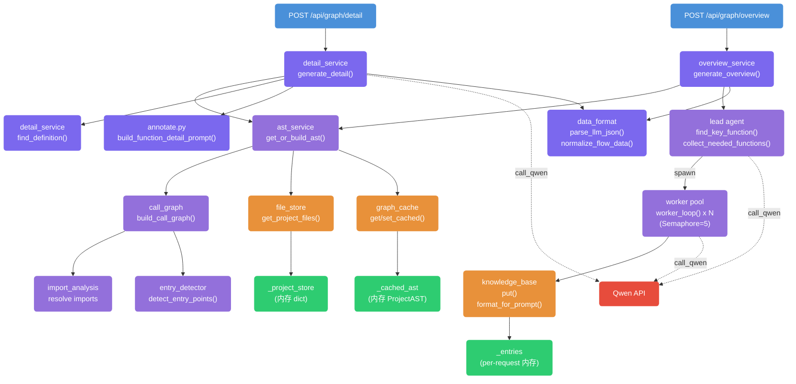

# graph_controller 调用链

```mermaid
flowchart TB
    classDef ctrl fill:#4A90D9,color:#fff,stroke:none,rx:6
    classDef svc fill:#7B68EE,color:#fff,stroke:none,rx:6
    classDef agent fill:#9370DB,color:#fff,stroke:none,rx:6
    classDef dao fill:#E8913A,color:#fff,stroke:none,rx:6
    classDef data fill:#2ECC71,color:#fff,stroke:none,rx:6
    classDef ext fill:#E74C3C,color:#fff,stroke:none,rx:6

    %% Controller
    C1["POST /api/graph/overview"]:::ctrl
    C2["POST /api/graph/detail"]:::ctrl

    %% Service — overview
    S1["overview_service\ngenerate_overview()"]:::svc

    %% Service — detail
    S2["detail_service\ngenerate_detail()"]:::svc
    S2a["detail_service\nfind_definition()"]:::svc
    S2b["annotate.py\nbuild_function_detail_prompt()"]:::svc

    %% Shared: AST pipeline
    AST["ast_service\nget_or_build_ast()"]:::agent
    P1["call_graph\nbuild_call_graph()"]:::agent
    P2["import_analysis\nresolve imports"]:::agent
    P3["entry_detector\ndetect_entry_points()"]:::agent

    %% Multi-agent
    A1["lead agent\nfind_key_function()\ncollect_needed_functions()"]:::agent
    A2["worker pool\nworker_loop() x N\n(Semaphore=5)"]:::agent

    %% Shared: data formatting
    FMT["data_format\nparse_llm_json()\nnormalize_flow_data()"]:::svc

    %% DAO
    D1["file_store\nget_project_files()"]:::dao
    D2["graph_cache\nget/set_cached()"]:::dao
    D3["knowledge_base\nput()\nformat_for_prompt()"]:::dao

    %% Data
    DB1["_project_store\n(内存 dict)"]:::data
    DB2["_cached_ast\n(内存 ProjectAST)"]:::data
    DB3["_entries\n(per-request 内存)"]:::data
    LLM["Qwen API"]:::ext

    %% === Overview chain ===
    C1 --> S1
    S1 --> AST
    AST --> P1
    P1 --> P2
    P1 --> P3
    AST --> D1
    AST --> D2
    S1 --> A1
    A1 -->|"spawn"| A2
    A2 --> D3
    A2 -.->|"call_qwen"| LLM
    A1 -.->|"call_qwen"| LLM
    S1 --> FMT

    %% === Detail chain ===
    C2 --> S2
    S2 --> AST
    S2 --> S2a
    S2 --> S2b
    S2 -.->|"call_qwen"| LLM
    S2 --> FMT

    %% DAO → Data
    D1 --> DB1
    D2 --> DB2
    D3 --> DB3
```
