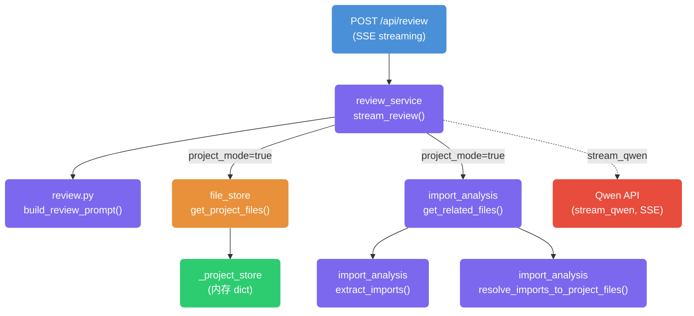

# review_controller 调用链

```mermaid
flowchart TB
    classDef ctrl fill:#4A90D9,color:#fff,stroke:none,rx:6
    classDef svc fill:#7B68EE,color:#fff,stroke:none,rx:6
    classDef dao fill:#E8913A,color:#fff,stroke:none,rx:6
    classDef data fill:#2ECC71,color:#fff,stroke:none,rx:6
    classDef ext fill:#E74C3C,color:#fff,stroke:none,rx:6

    %% Controller
    C1["POST /api/review\n(SSE streaming)"]:::ctrl

    %% Service
    S1["review_service\nstream_review()"]:::svc
    S2["review.py\nbuild_review_prompt()"]:::svc
    S3["import_analysis\nget_related_files()"]:::svc
    S3a["import_analysis\nextract_imports()"]:::svc
    S3b["import_analysis\nresolve_imports_to_project_files()"]:::svc

    %% DAO
    D1["file_store\nget_project_files()"]:::dao

    %% Data
    DB1["_project_store\n(内存 dict)"]:::data
    LLM["Qwen API\n(stream_qwen, SSE)"]:::ext

    %% Connections
    C1 --> S1
    S1 -->|"project_mode=true"| D1
    S1 -->|"project_mode=true"| S3
    S3 --> S3a
    S3 --> S3b
    S1 --> S2
    S1 -.->|"stream_qwen"| LLM
    D1 --> DB1
```
