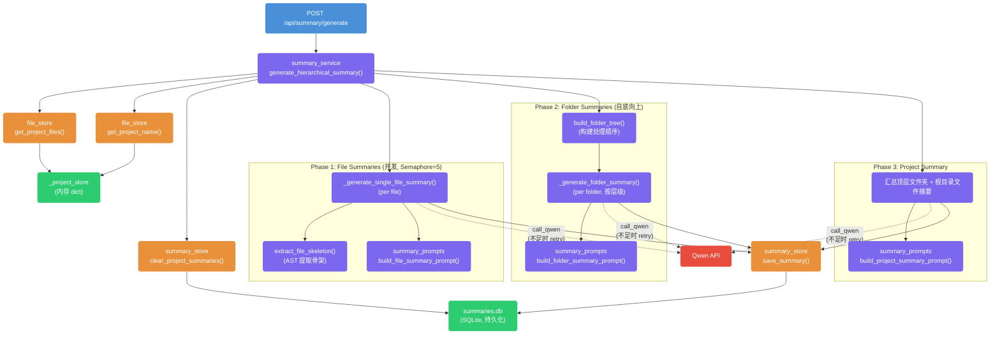

# summary_controller 调用链

```mermaid
flowchart TB
    classDef ctrl fill:#4A90D9,color:#fff,stroke:none,rx:6
    classDef svc fill:#7B68EE,color:#fff,stroke:none,rx:6
    classDef dao fill:#E8913A,color:#fff,stroke:none,rx:6
    classDef data fill:#2ECC71,color:#fff,stroke:none,rx:6
    classDef ext fill:#E74C3C,color:#fff,stroke:none,rx:6

    %% Controller
    C1["POST /api/summary/generate"]:::ctrl

    %% Service
    S1["summary_service\ngenerate_hierarchical_summary()"]:::svc

    subgraph PHASE1["Phase 1: File Summaries (并发, Semaphore=5)"]
        S2["_generate_single_file_summary()\n(per file)"]:::svc
        S2a["extract_file_skeleton()\n(AST 提取骨架)"]:::svc
        S2b["summary_prompts\nbuild_file_summary_prompt()"]:::svc
    end

    subgraph PHASE2["Phase 2: Folder Summaries (自底向上)"]
        S3["_generate_folder_summary()\n(per folder, 按层级)"]:::svc
        S3a["build_folder_tree()\n(构建处理顺序)"]:::svc
        S3b["summary_prompts\nbuild_folder_summary_prompt()"]:::svc
    end

    subgraph PHASE3["Phase 3: Project Summary"]
        S4["汇总顶层文件夹 + 根目录文件摘要"]:::svc
        S4a["summary_prompts\nbuild_project_summary_prompt()"]:::svc
    end

    %% DAO
    D1["file_store\nget_project_files()"]:::dao
    D2["file_store\nget_project_name()"]:::dao
    D3["summary_store\nclear_project_summaries()"]:::dao
    D4["summary_store\nsave_summary()"]:::dao

    %% Data
    DB1["_project_store\n(内存 dict)"]:::data
    DB2["summaries.db\n(SQLite, 持久化)"]:::data
    LLM["Qwen API"]:::ext

    %% Controller → Service
    C1 --> S1
    S1 --> D1
    S1 --> D2
    S1 --> D3

    %% Phase 1
    S1 --> S2
    S2 --> S2a
    S2 --> S2b
    S2 -.->|"call_qwen\n(不足时 retry)"| LLM
    S2 --> D4

    %% Phase 2
    S1 --> S3a
    S3a --> S3
    S3 --> S3b
    S3 -.->|"call_qwen\n(不足时 retry)"| LLM
    S3 --> D4

    %% Phase 3
    S1 --> S4
    S4 --> S4a
    S4 -.->|"call_qwen\n(不足时 retry)"| LLM
    S4 --> D4

    %% DAO → Data
    D1 --> DB1
    D2 --> DB1
    D3 --> DB2
    D4 --> DB2
```
