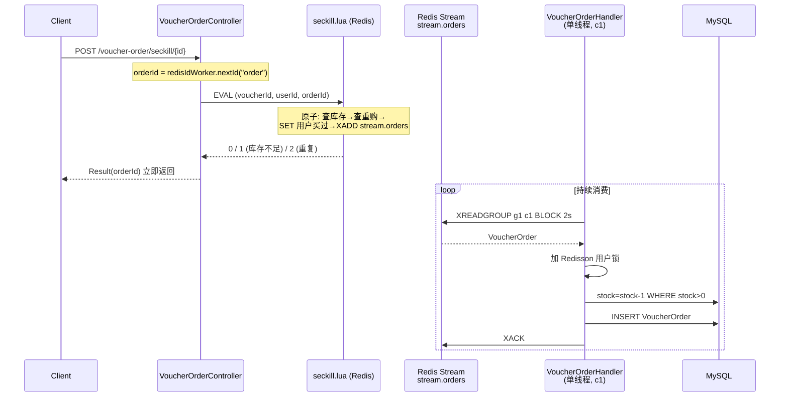

## 速览

**定位**：用 Lua + Redis Stream 撑起的高并发秒杀闭环

**文件清单**

| 路径 | 职责 |
|---|---|
| `TestProject/main/java/com/hmdp/controller/VoucherController.java` | HTTP 入口：新增/查询优惠券 |
| `TestProject/main/java/com/hmdp/controller/VoucherOrderController.java` | HTTP 入口：触发秒杀下单 |
| `TestProject/main/java/com/hmdp/entity/SeckillVoucher.java` | 秒杀场次实体（库存 + 起止时间） |
| `TestProject/main/java/com/hmdp/entity/Voucher.java` | 优惠券基础信息实体 |
| `TestProject/main/java/com/hmdp/entity/VoucherOrder.java` | 订单实体（用户/券/支付状态） |
| `TestProject/main/java/com/hmdp/mapper/SeckillVoucherMapper.java` | 秒杀券 CRUD MyBatis 接口 |
| `TestProject/main/java/com/hmdp/mapper/VoucherMapper.java` | 优惠券 CRUD + 联表查询接口 |
| `TestProject/main/java/com/hmdp/mapper/VoucherOrderMapper.java` | 订单 CRUD MyBatis 接口 |
| `TestProject/main/java/com/hmdp/service/ISeckillVoucherService.java` | 秒杀券 Service 契约 |
| `TestProject/main/java/com/hmdp/service/IVoucherOrderService.java` | 秒杀下单 Service 契约 |
| `TestProject/main/java/com/hmdp/service/IVoucherService.java` | 优惠券 Service 契约 |
| `TestProject/main/java/com/hmdp/service/impl/SeckillVoucherServiceImpl.java` | 秒杀券 CRUD 骨架（无业务逻辑） |
| `TestProject/main/java/com/hmdp/service/impl/VoucherOrderServiceImpl.java` | 秒杀核心：Lua + Stream 异步下单 |
| `TestProject/main/java/com/hmdp/service/impl/VoucherServiceImpl.java` | 普通券 + 秒杀券创建（库存预热到 Redis） |
| `TestProject/main/java/com/hmdp/utils/ILock.java` | 锁的最小接口（tryLock / unlock） |
| `TestProject/main/java/com/hmdp/utils/RedisIdWorker.java` | 时间戳 + Redis 自增的全局 ID 生成 |
| `TestProject/main/java/com/hmdp/utils/SimpleRedisLock.java` | 教学版分布式锁（UUID 防误删 + Lua 原子解锁） |

**跨模块关系**（由 AST 计算）

_本模块调用其他模块：_
- → [module_4](#wiki:module_4) (7 处调用)

**阅读建议**

> 想看清"高并发下单为什么必须 Lua + Stream"——直奔「演进轨迹」与「Lua 资格判定」两节；想理解多层防御为什么没"过设计"——看「多层一致性防御」并留意 `@Transactional` 那条。

---

本模块是整套秒杀系统的执行枢纽。它要在毫秒级回答一个看似简单的问题——「这个用户能不能抢到这张券」——并把后续的"扣库存、写订单"全部安全异步化。模块边界很清晰：**库存判定、锁机制、订单 ID 生成、消息流转**都在内；**用户身份、统一响应封装、Redis Key 常量**走 [module_4](#wiki:module_4) 提供，不重复造。

可以把这条秒杀链路想象成一个**取件码 + 快递柜**模型：用户在前台拿到取件码（Lua 在 Redis 内完成资格判定 + 入队，毫秒返回），快递员（异步 Worker）在后台从快递柜（Redis Stream）按节奏取件并配送（写 DB）。前台不堆积、后台不丢件，关键在两件事——**取件码的唯一性**（防超卖、防重购）和**快递柜的持久性**（崩溃可恢复）。

[VoucherOrderServiceImpl](#code:ref_1) 内部同时存活着**五个版本**的下单实现——只有最上面一份是活代码，下面四份用 `/* */` 包着。**这条演进线索本身就是模块的灵魂**：每一次重写都在解决前一版的真实并发缺陷，读懂它比记住任何一个版本的细节更重要。读完本节，你应当能解释：(1) 为什么资格判定必须放进 Lua、(2) 为什么 v2/v3 的 `@Transactional` + 分布式锁组合是错的、(3) 为什么队列必须从 JVM 内存换成 Redis Stream、(4) "已经在 Lua 去重过了"为什么还要在 Worker 里加 Redisson 锁。

路线图：§1 演进轨迹给整体上下文 → §2 现役链路全景 → §3-§5 拆解三层（Lua / Stream / 防御）→ §6-§7 走辅助设施（订单 ID / 双锁实现）→ §8 提炼设计洞察。

## 1. 演进轨迹：从 synchronized 到 Lua + Stream

把代码里被注释掉的四个版本按时间倒序排列，能清楚看到秒杀架构的真实演进路径。每个版本被淘汰，都因为遇到了下一版才解决的问题——**不读懂这条线，就理解不了为什么 v5 长得这么"复杂"**。

| 版本 | 同步路径 | 持久化 | 致命缺陷 |
|---|---|---|---|
| v1 | `synchronized(userId.toString().intern())` | 同步 DB | JVM 内锁，集群部署直接失效 |
| v2 | SimpleRedisLock + `@Transactional` | 同步 DB | **lock-tx ordering bug**（详见 §5.4） |
| v3 | Redisson + `@Transactional` | 同步 DB | 同 v2 的 ordering bug，只是把锁换得更可靠 |
| v4 | Lua（资格判定）+ JVM 内 BlockingQueue | 异步 DB | 队列在堆上，JVM 崩溃 = 已抢到的订单全丢 |
| v5（现役） | Lua + Redis Stream | 异步 Worker + 三层防御 | 仍然是 Redis SPOF（详见 §8） |

> **关键观察**：v2 → v3 是"把锁换得更好但**没解决根因**"——这一步教训直接影响 v4/v5 的设计。现役 [createVoucherOrder](#code:ref_5) **故意没加 `@Transactional`**，宁可放弃 stock-decrement 与 order-save 的原子性，也要避免 Spring AOP 事务边界与锁释放点错位。

## 2. 现役链路全景

整条链路按「**同步路径只做能在 Redis 内完成的事**」这条原则切成三层，对应三个时间窗口：



三层各自有独立的失败策略：

```
┌──────────────────────────────────────────────────────────────┐
│  Layer 1: 同步入口（毫秒级）                                  │
│    Lua 内原子判定 → 失败立即返回错误码给用户                   │
├──────────────────────────────────────────────────────────────┤
│  Layer 2: 异步队列（持久化）                                  │
│    Stream 消息持久化 + PEL 兜底未 ACK 消息                    │
├──────────────────────────────────────────────────────────────┤
│  Layer 3: 持久化（最终一致）                                  │
│    Redisson 用户锁 + DB 乐观锁，软失败只打日志                │
└──────────────────────────────────────────────────────────────┘
```

> **核心要点**：用户感知延迟（Layer 1）和持久化吞吐（Layer 2-3）被刻意解耦——前者要求毫秒级、后者要求最终一致。后面的章节按这三层逐层下钻。

## 3. Lua 资格判定

资格判定是同步路径的全部内容——必须**在一次 Redis 调用内**完成"库存判断 + 一人一单 + 入队"。任何拆成多步的方案都会在拆开的缝隙里产生竞态。

### 3.1 原子三步：库存 → 去重 → 入队

[seckillVoucher](#code:ref_2) 触发同步路径，整个判定逻辑通过 [SECKILL_SCRIPT 静态加载](#code:ref_3) 的 `seckill.lua` 一次执行：

```java
Long result = stringRedisTemplate.execute(
        SECKILL_SCRIPT,
        Collections.emptyList(),
        voucherId.toString(), userId.toString(), String.valueOf(orderId)
);
```

虽然 `.lua` 文件不在本模块内，但从调用约定可以**反推**它的三步语义——库存自减、用户去重 SET、`XADD stream.orders` 推消息——三步在同一个 Redis 命令里执行。**Redis 单线程模型保证了这是事务级原子操作**。

> **细节：Cluster 兼容性问题**。`Collections.emptyList()` 作为 `keys` 参数意味着脚本不声明任何 KEY，所有数据通过 `argv` 传入。这让脚本**不能在 Redis Cluster 上安全运行**——Cluster 要求 KEYS 用于 slot 路由。这是 v5 的隐式假设：单实例 Redis 或代理模式（Codis 之类）。

### 3.2 返回码即失败枚举

返回 `Long` 而非 `boolean` 是有意为之——把失败原因精细到错误码：

| 返回码 | 含义 |
|---|---|
| `0` | 抢到 |
| `1` | 库存不足 |
| `2` | 重复下单 |

这种设计避免了同步路径上"先查库存，再查是否买过"两次往返 Redis 的竞态——在两次往返之间另一个用户可能把最后一张券抢走。

### 3.3 替代方案的死路

#### 为什么不用 MULTI/EXEC？

Redis 事务（MULTI/EXEC）只能原子执行命令序列，**不能在中途分支**。秒杀必须有 `if 库存>0 then 扣减 else 返回失败` 的分支，事务无能为力。

#### 为什么不用 WATCH 乐观事务？

高并发下 WATCH 失败重试会形成**惊群**——所有客户端在同一个 key 上反复 retry，反而比悲观锁更差。Lua 把判定收拢到 Redis 单线程内，连"重试"都不存在。

### 3.4 orderId 在 Java 端预生成的非典型选择

注意 `seckillVoucher` 里 `orderId` 是**先在 Java 调** [RedisIdWorker.nextId](#code:ref_6) **生成、再透传进 Lua**。常见做法是把 ID 生成也放进 Lua（少一次 Redis 往返），本项目反其道而行：

- **理由 1**：`RedisIdWorker` 是项目里**唯一的 ID 源**，其他业务也用它。保持口径一致比省一次往返重要。
- **理由 2**：Lua 脚本不应跨业务 key（`icr:order:yyyy:MM:dd` 是 ID 计数器，与秒杀业务无关）——保持脚本单一职责。

> **代价**：Lua 失败（`r != 0`）时，Java 已经消耗了一个 ID 但订单永远不会被创建，产生 ID 跳号。这不影响正确性，但如果业务依赖 ID 严格连续会踩坑。

## 4. 异步下单：Stream + 单线程消费

资格判定通过后，订单落库**完全异步**——同步路径返回的瞬间，DB 还没写。Stream + Worker 这套组合是 v4 的 BlockingQueue 升级而来，每一处选择都对应一个 v4 踩过的坑。

### 4.1 为什么不是 BlockingQueue

v4 的 `new ArrayBlockingQueue<>(1024 * 1024)` 被淘汰的根本原因是**进程崩溃即数据丢失**——JVM 内队列的元素全在堆上。Stream 把队列搬到 Redis，三个核心收益：

1. **消息持久化**——订单不再依赖 JVM 存活
2. **消费者组**记录消费位置——重启后能从断点继续
3. **PEL（Pending Entries List）**保留未 ACK 消息——失败可重试

代价是每次入队多一次 Redis 往返，对秒杀的同步路径完全可接受。

### 4.2 消费循环：XREADGROUP + ACK 时序

[VoucherOrderHandler.run](#code:ref_4) 是核心消费者，运行在 `Executors.newSingleThreadExecutor()` 上：

```java
List<MapRecord<String, Object, Object>> list = stringRedisTemplate.opsForStream().read(
        Consumer.from("g1", "c1"),
        StreamReadOptions.empty().count(1).block(Duration.ofSeconds(2)),
        StreamOffset.create("stream.orders", ReadOffset.lastConsumed())
);
```

两处关键设计：

- **`block(2s)`**——让消费线程在没消息时挂起在 Redis 端，而不是空转 CPU
- **`ReadOffset.lastConsumed()`（即 `>`）**——只读未消费的新消息，PEL 里的旧消息由独立循环兜底

> **强约束：ACK 必须在 DB 写入成功之后**——否则进程在 ACK 之后、写 DB 之前重启，这条订单永久丢失。这是从「尽力而为」升级到「至少一次（at-least-once）」语义的根基。

### 4.3 Pending List 与异常补偿

#### 主循环 vs PEL 循环的职责分离

`run()` 主循环里一旦 `catch (Exception e)`，立即调用 [handlePendingList](#code:ref_7)——这是另一个独立循环，用 `ReadOffset.from("0")` 从 PEL 起点读取所有未 ACK 的消息重试。两个循环**故意拆开**：

- 主循环只读新消息——速度快、延迟低
- PEL 循环兜底失败消息——不影响新订单的处理延迟

#### 失败模式：无最大重试上限

> **失败模式警示**：如果 `createVoucherOrder` 持续抛异常（比如 DB 永久宕机），同一条消息会在主循环和 PEL 循环之间反复横跳。代码**没有最大重试次数限制**，需要靠监控发现 `XPENDING stream.orders g1` 长度异常增长才能介入。这是 v5 的一个真实风险点。

### 4.4 单消费者 c1 是水平扩容的天花板

消费者名 `c1` 和组名 `g1` **硬编码**在源码里。要扩容必须改三处：

1. `Executors.newSingleThreadExecutor()` → 多线程池
2. 给每个线程分配独立消费者名（`c1`/`c2`/`c3`...）
3. 协调消费者数量与 PEL 重试逻辑

> **设计权衡**：当前实现把吞吐瓶颈定在单线程 + 单条 DB 写入延迟——这是**有意为之的隐式背压**。让压力可见地积压在 Redis（`XLEN stream.orders` 监控可见）而不是把 DB 打挂。

## 5. 多层一致性防御

理论上 Lua 已经在 Redis 端完成了"一人一单"去重，为什么 [createVoucherOrder](#code:ref_5) 里还要再加 Redisson 锁 + DB 兜底？这是**纵深防御**思想——三层各防一类失败假设，每层成本都低、收益都明确。

### 5.1 用户级 Redisson 锁的真实价值

```java
RLock redisLock = redissonClient.getLock("lock:order:" + userId);
boolean isLock = redisLock.tryLock();
```

锁粒度是 `userId` 而非 `voucherId`——已知一人一单，**用户级锁让不同用户的下单完全并行**。`tryLock()` 不阻塞，立刻失败而非排队，符合"快速失败"原则。

> **真实价值**：未来横向扩容到多 Worker 实例时，这层锁能防止两个 Worker 同时拿到同一条 PEL 消息后的重复落库。Stream 消费者组对**新消息**保证不重复，但 PEL 重试在极端时序下仍可能并发。

### 5.2 数据库 stock>0 乐观更新

```java
seckillVoucherService.update()
        .setSql("stock = stock - 1")
        .eq("voucher_id", voucherId).gt("stock", 0)
        .update();
```

`gt("stock", 0)` 把超卖检查放进 SQL `WHERE` 条件，依赖**数据库行锁兜底**。这是第三道防线——即便 Lua 和 Redisson 都被绕过（比如有人手工调内部 RPC），DB 仍然不会出现负库存。

### 5.3 三层失败语义对比

| 层 | 失败时返回 | 失败成本 | 监控信号 |
|---|---|---|---|
| Lua（库存自减） | 返回码 1/2 | 同步路径直接失败给用户 | API 错误率 |
| Redisson 锁 | `log.error` + return | Worker 跳过这条消息 | 日志 ERROR 计数 |
| DB stock>0 | `log.error` + return | Worker 跳过这条消息 | 日志 ERROR 计数 |

后两层是 Worker 内部的"软失败"——只打日志、不抛异常、不重试。这避免了无意义的重试风暴，但也意味着**这种异常需要外部监控发现**，代码本身不会自愈。

### 5.4 为什么没加 @Transactional：v2/v3 的教训

`createVoucherOrder` **故意没加 `@Transactional`**——这是从 v2/v3 的失败里学到的。

#### v2/v3 的 lock-tx ordering bug

```java
// v2/v3（已废弃）：
@Transactional
public Result createVoucherOrder(...) {
    redisLock.tryLock();
    try {
        // ... 扣库存 + save 订单
    } finally {
        redisLock.unlock();   // ← 锁先释放
    }
    // ← 这里事务才提交（@Transactional AOP 在方法返回后才 commit）
}
```

**时间窗口错位**：A 线程释放锁后到事务真正 commit 之前，B 线程可以拿到锁，查询数据库看不到 A 写的订单（A 还没 commit），于是 B 也走完整套扣库存→写订单流程。两个订单同时入库，重复下单防御被绕过。

#### v5 的取舍

v5 完全放弃 stock-decrement 与 order-save 的原子性——`save()` 立刻 commit，`unlock()` 在 finally 里也是 commit 之后。

> **代价**：如果 `save(voucherOrder)` 抛异常，stock 已扣但订单没写。靠 PEL 重试 + `query().count()` 的幂等检查兜底——重试时如果发现订单已存在，跳过。这是个清醒的取舍：**正确性 > 原子性**。

## 6. 全局唯一订单 ID（RedisIdWorker）

订单 ID 用「时间戳 + Redis 自增」拼出 64 位，看似简单，但每个比特位都对应一个非显然的约束。

### 6.1 比特布局

[RedisIdWorker.nextId](#code:ref_6) 的实现：

```java
long timestamp = nowSecond - BEGIN_TIMESTAMP;        // 31 位时间戳
long count = stringRedisTemplate.opsForValue()
        .increment("icr:" + keyPrefix + ":" + date); // 32 位序列
return timestamp << COUNT_BITS | count;
```

```
┌─ 64 位订单 ID ─────────────────────────────────────────────────┐
│ [1 位符号位] [31 位时间戳]      [32 位日序列]                   │
│      0        相对 2022-01-01    icr:order:2026:04:26 自增      │
└────────────────────────────────────────────────────────────────┘
```

`BEGIN_TIMESTAMP = 1640995200L`（2022-01-01 UTC 00:00）作为时间起点，把时间戳压缩到 31 位（约 68 年寿命）。

### 6.2 几个非显然约束

| # | 约束 | 影响 |
|---|---|---|
| 1 | **强依赖系统时钟单调** | 时钟回拨会生成重复 ID，与 Snowflake 同款痛点 |
| 2 | **Redis 单点是 SPOF** | 故障期间 ID 生成完全瘫痪 |
| 3 | **序列号 32 位 = 单日上限约 42 亿** | 秒杀够用；通用 ID 会撞天花板 |
| 4 | **按日重置，跨日有非单调跳变** | 业务依赖 ID 严格单增做去重/排序会踩坑 |

> **设计权衡**：按日重置而非全局自增是为了**避免单个 Redis key 的 INCR 成为热点**。代价是跨天处的 ID "时间戳大、序列号小"，看起来不连续。

## 7. 教学痕迹：SimpleRedisLock vs Redisson

模块里 [SimpleRedisLock](#code:ref_8) 和 Redisson 同时存在，但活代码只用 Redisson——SimpleRedisLock 实质是教学示例，展示一个**最小化但正确**的分布式锁怎么写。读这两份实现的对比能学到比单独读任一个都多的东西。

### 7.1 SimpleRedisLock 的两个核心设计

#### UUID + ThreadId 双重身份标记

```java
private static final String ID_PREFIX = UUID.randomUUID().toString(true) + "-";
```

`ID_PREFIX` 是 JVM 启动时生成的常量——**JVM 间用 UUID 区分**，**JVM 内拼上 `Thread.currentThread().getId()` 区分线程**。两层拼起来唯一标识"锁的真正主人"。

> **这避免了什么 bug**：线程 A 锁过期 → 线程 B 拿到锁 → 线程 A 苏醒后误删 B 的锁。不带身份标记的 `DEL key` 会无差别删除，是分布式锁的经典坑。

#### Lua 原子解锁

[SimpleRedisLock.unlock](#code:ref_9) 调用 `unlock.lua` 而不是 Java 端"先 GET 再 DEL"。

> **这避免了什么 bug**：GET 和 DEL 之间锁可能被另一个线程抢走，构成上面那条经典 bug 的另一个变种。Lua 把"判断持有者→删除"做成一次原子操作。文件里被注释的 Java 实现保留着，正是为了对照。

### 7.2 Redisson 多出的三件事

SimpleRedisLock 缺三件，刚好都是 Redisson 提供的：

| 功能 | SimpleRedisLock | Redisson |
|---|---|---|
| 看门狗自动续期 | ❌ 业务超时长锁会被过期"踢走" | ✅ 自动续 |
| 可重入 | ❌ 同线程二次 tryLock 死锁 | ✅ |
| 公平/读写锁 | ❌ | ✅ |

> **小结**：SimpleRedisLock 是"如何在最少代码里写对一个分布式锁"的教学样本；Redisson 是生产级实现。对比这两套能让读者理解为什么生产用厚重的库而不是几行代码搞定。

## 8. 设计洞察

整本模块走过来，可以提炼出 8 条**为什么这样做**而非**是什么**的洞察：

1. **同步快、异步重**——同步路径只做 Redis 内能完成的事，DB 写入全部推到 Worker。这是"用户感知延迟"和"持久化吞吐"解耦的核心策略。

2. **Stream 替代 BlockingQueue 的核心收益是 PEL**——JVM 队列里的消息进程崩溃即丢；Stream + 消费者组让"消费但未 ACK"的消息留在 PEL 等待重试。这是「至少一次」语义的根基。

3. **三层防御不是过设计**——Lua 防大多数情况、Redisson 防多 Worker 并发、DB `stock>0` 防一切绕过。每一层成本都很低，但消除了不同失败假设下的隐患。

4. **`@Transactional` 与分布式锁不能简单组合**——v2/v3 的 ordering bug 教训：AOP 事务边界晚于 finally unlock，锁释放后事务尚未 commit 的窗口里下一线程能看到"无订单"，构成绕过。v5 用拆事务 + 幂等查询替代。

5. **单线程 Executor 是隐式背压**——吞吐瓶颈刻意定在单 Worker，让压力可见地积压在 Redis 而不是把 DB 打挂。要扩容必须主动改三处（线程池 + 消费者名 + PEL 协调）。

6. **Redis 是整条秒杀链路的 SPOF**——库存预热在 [addSeckillVoucher](#code:ref_10) 里同步写 Redis；ID 生成依赖 Redis；Stream 队列在 Redis；锁在 Redis。Redis 故障 = 秒杀完全不可用。这是有意识的取舍——业务允许"故障期间下线"，比"故障期间出错乱"安全得多。

7. **库存预热与持久层的不一致风险**——`addSeckillVoucher` 用 `@Transactional` 包住 DB 双写，但**最后那行 `stringRedisTemplate.opsForValue().set(...)` 不在事务内**——DB 提交后、Redis SET 前进程被杀，DB 里有秒杀场次但 Redis 里没库存，前端能看到券但抢不到。生产环境需要补一个"启动时校验/重建 Redis 库存"的脚本。

8. **PEL 没有最大重试次数**——持续失败的消息会无限循环。监控 `XPENDING stream.orders g1` 的长度是发现 DB 故障最快的方法之一，但代码本身不会自愈。这条和单线程 Executor 配合，能把 DB 故障**可见地**暴露出来——这是个特性而非 bug。
